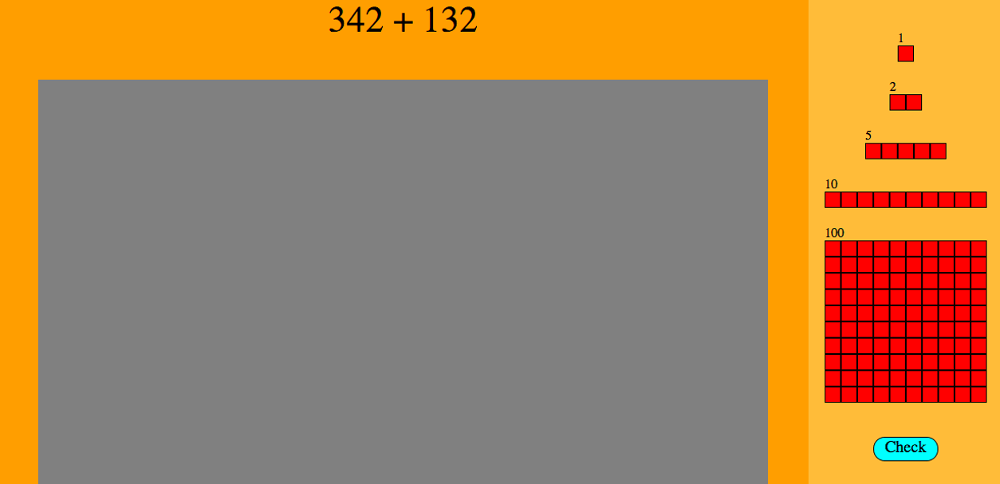
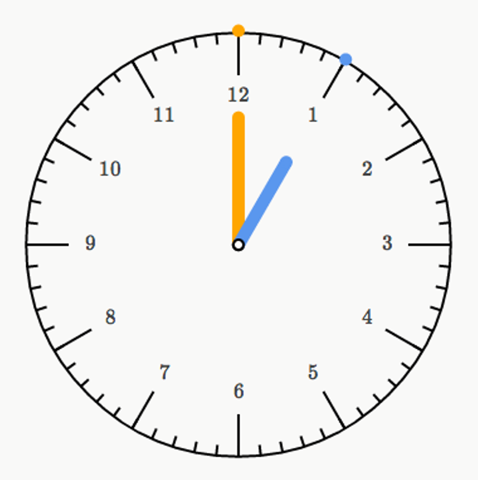
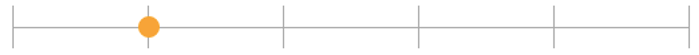

## Drag and Drop Project

Select from one of the projects below that all focus on dragging and dropping of objects in the browser. Or create your own project.

- [Counting with Blocks](Counting_with_Blocks)
- [Money](Money)
- [Building the clock](Building_the_clock)
- [NumberLine](Numberline)
- [Tic Tac Toe](Tic_Tac_Toe)

 
 

 
 

## Counting with Blocks

> Goal: Build a site that allows you to solve addition using blocks

### Requirements

- Use HTML, CSS and JavaScript Nothing Else. Also, do not use the “draggable” element of HTML 5, instead use event listeners.
- Have a math problem that will give them the value of how many blocks they need
- Have a little “toolbox” with blocks of different values
- Have an area that they drop the blocks to equal the value of the problem
- When you drop the blocks, have them snap into a grid system. Kinda like when you move icons around on your desktop how they snap into position.
- Have a check button that will check to see if the amount of blocks put in is equal to the amount displayed in the problem

 
 

 
 

## Money

> Goal: Build a site that makes you give the right change

### Requirements

- Use HTML, CSS and JavaScript Nothing Else.
- This project is very similar to the previous one, but it is with money
- Display an amount of money ($.37, $2.16, etc)
- As in the previous problem, have a little toolbox or wallet that has coins of different values
- Have a place where you drag and drop the coins to equal the shown amount
- have a check button

 
 

 
 

## Building the clock

### Level 1

> Goal: Build a clock with moving hands

### Requirements

- Use HTML, CSS, and JavaScript. Nothing else.
- The hands are to be made out of divs.
- The image of the clock is simply copied from the link below the clock and used as the background. This picture is simply an example of how the finished product should look.
- http://www.handwritingforkids.com/handwrite/manuscript/clock/images/big-analog-clock.gif ← nice looking clock
- The dots on the outside should get bigger on hover (showing they can be clicked on to move the hands) and the end of each hand should do the same thing.
- Make the hands able to be dragged. They can only be dragged to each tick mark.
- HINT: Use -webkit-transform and -webkit-transform-origin.

### Level 2

> Goal: Manipulate the clock

### Requirements

- Allow user to set the time by typing in the hour and minutes in text boxes.
- Have the system recognize what time was set and display that on the page for the user to see.
- Set the clock to a specific time so that when the page loads the hands on the clock will set to that time.

### Level 3

> Goal: Create quizzes

### Requirements

- Generate questions with random times to be answered by the user. Each question will be one modeled like this: “Set the clock to 4:15”. Generate these questions with AJAX calls to a PHP page where the hour and minutes will be generated. (http://w3schools.com/ajax/ajax_intro.asp or http://www.w3schools.com/jquery/ajax_ajax.asp)
- Make a button that checks if the hands are set correctly and track the correct answers and the wrong answers though a session variable.

 
 

 
 

## NumberLine

### Code

- HTML
- CSS
- Javascript
- No jQuery

> Create a numberline for basic arithmetic (example: https://www.khanacademy.org/math/arithmetic/addition-subtraction/basic_addition/e/number_line)
> Suggestion: Use 
 tags

### Requirements

- Handle snaps to integer points when they get close
- Numberline range and size is dynamic
- Feedback on select (change color when clicked/dragged)
- Handle slides without jumping too much

 
 

 
 

## Tic Tac Toe

### Code

- HTML
- CSS
- JavaScript
- No JQuery
- No HTML 5

### Requirements

- Create a tic tac toe game!!!!
- Have a holder of 5 x’s and 5 o’s off to the side of the board
- Drag and drop x’s and o’s onto the board and when you drop them have them snap into the middle of the square
